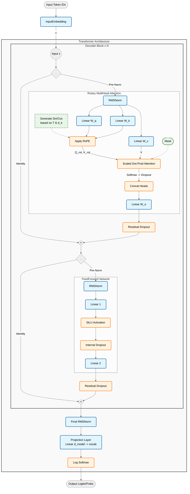

```mermaid
%%{init: {'theme': 'neutral', 'themeVariables': { 'fontSize': '16px', 'fontFamily': 'arial'}}}%%
flowchart TD
    %% Input and Embeddings
    Input([Input Token IDs]) --> Embed[InputEmbedding]
    Embed -->|x| BlockStart

    subgraph Transformer [Transformer Architecture]
        direction TB
        
        %% Decoder Block Structure (Repeated N times)
        subgraph DecoderBlock [Decoder Block x N]
            direction TB
            
            %% --- Sub-Layer 1: Rotary Self Attention ---
            BlockStart((Input x)) --> Res1_Split{.}
            
            %% Pre-Norm Path
            Res1_Split -->|Pre-Norm| Norm1[RMSNorm]
            
            subgraph MHA [Rotary MultiHead Attention]
                direction TB
                Norm1 --> ProjQ[Linear W_q]
                Norm1 --> ProjK[Linear W_k]
                Norm1 --> ProjV[Linear W_v]
                
                %% RoPE Logic
                SinCos[Generate Sin/Cos <br/> based on T & d_k] -.-> ApplyRoPE
                ProjQ --> ApplyRoPE[Apply RoPE]
                ProjK --> ApplyRoPE
                
                ApplyRoPE -->|Q_rot, K_rot| CalcAttn[Scaled Dot-Prod Attention]
                ProjV -->|V| CalcAttn
                
                Mask([Mask]) -.-> CalcAttn
                CalcAttn -->|Softmax -> Dropout| Concat[Concat Heads]
                Concat --> ProjO[Linear W_o]
            end
            
            %% Residual Connection 1
            ProjO --> DropRes1[Residual Dropout]
            Res1_Split -->|Identity| Add1((+))
            DropRes1 --> Add1
            
            %% --- Sub-Layer 2: Feed Forward ---
            Add1 --> Res2_Split{.}
            
            %% Pre-Norm Path
            Res2_Split -->|Pre-Norm| Norm2[RMSNorm]
            
            subgraph FFN [FeedForward Network]
                direction TB
                Norm2 --> Lin1[Linear 1]
                Lin1 --> Act[SiLU Activation]
                Act --> DropFF[Internal Dropout]
                DropFF --> Lin2[Linear 2]
            end
            
            %% Residual Connection 2
            Lin2 --> DropRes2[Residual Dropout]
            Res2_Split -->|Identity| Add2((+))
            DropRes2 --> Add2
        end

        %% Final Output Layers
        Add2 --> FinalNorm[Final RMSNorm]
        FinalNorm --> ProjLayer[Projection Layer<br/>Linear d_model -> vocab]
        ProjLayer --> LogSoft[Log Softmax]
    end

    LogSoft --> Output([Output Logits/Probs])

    %% Styling
    classDef container fill:#f9f9f9,stroke:#333,stroke-width:2px;
    classDef component fill:#e1f5fe,stroke:#01579b,stroke-width:2px,rx:5,ry:5;
    classDef operation fill:#fff3e0,stroke:#ff6f00,stroke-width:2px,rx:5,ry:5;
    classDef logic fill:#e8f5e9,stroke:#2e7d32,stroke-width:2px,stroke-dasharray: 5 5;

    class Transformer,DecoderBlock container;
    class Embed,Norm1,Norm2,FinalNorm,ProjLayer,ProjQ,ProjK,ProjV,ProjO,Lin1,Lin2 component;
    class Act,ApplyRoPE,CalcAttn,LogSoft,Concat,DropRes1,DropRes2,DropFF operation;
    class SinCos,Mask logic;
```
