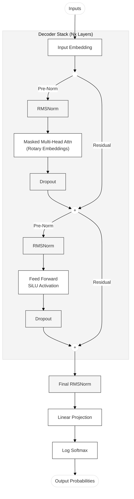

# Modified Transformer
This repository contains a PyTorch implementation of a **Decoder-only Transformer** architecture. It incorporates modern architectural improvements such as **RMSNorm**, **Pre-Normalization**, and **Rotary Positional Embeddings (RoPE)**, which are commonly used in state-of-the-art LLMs (like LLaMA and PaLM).

## Model Architecture
`model.py`
The architecture deviates from the original "Attention Is All You Need" paper by incorporating modern enhancements for stability and performance.

| Component | Original Transformer | This Repo |
|---------|----------------------|-----------|
| Norm    | LayerNorm (Post)     | RMSNorm (Pre) |
| PosEnc | Absolute             | RoPE |
| FFN Act| ReLU                 | SiLU |

- Input Embeddings: Unlike the original paper, embeddings are not scaled by $\sqrt{d_{model}}$.
- Rotary Positional Embeddings (RoPE): Instead of absolute positional encodings, position information is encoded by rotating the Query and Key vectors at every attention step.
- RMSNorm: Uses Root Mean Square Normalization instead of LayerNorm. This normalizes scale without centering the mean, improving stability
- Pre-Normalization: Normalization is applied before the sub-layers (Attention/FFN). The residual connection bypasses the norm, creating a "gradient superhighway".
- SiLU Activation: Feed-forward networks use the Sigmoid Linear Unit (SiLU) activation ($x \cdot \sigma(x)$) instead of ReLU.

The following diagram illustrates the data flow through the model, highlighting the **Pre-Norm** residual connections and the **RoPE** injection points.

## Tokenizer
Uses OpenAI's tiktoken for subword tokenization.

*Note on Efficiency*: Tiktoken's large vocabulary (~100k tokens) results in a parameter imbalance for small models ($d_{model}=256$), where the embedding layer consumes significantly more memory than the reasoning layers. A smaller, custom BPE tokenizer would be more parameter-efficient for this scale.

## Training
`train.py`

- Dataset: Trained on the TinyStories dataset (first 50k samples), which contains simple English stories suitable for small models.
- Optimization: Uses AdamW optimizer with Cosine Annealing learning rate scheduling.
- Precision: Supports Mixed Precision training (torch.amp) for faster execution on GPUs.
- Logging: Metrics (Loss, Learning Rate) are logged via TensorBoard.

## Inference
`Inference.ipynb`

Observations from the file reveal distinct strengths and limitations characteristic of small-scale transformers ($N=6$, $d_{model}=256$).

1. ### Structural Coherence

The model successfully captures narrative structure and grammar. It understands that stories begin with an introduction and require subject-verb agreement.

*Example (Story 2): "The brave knight went to the beach. It was a picture of a castle..."*

Observation: The model correctly associates entities ("knight", "castle") even in novel contexts ("beach"). The sentence structure is grammatically perfect, demonstrating that the RoPE implementation is correctly preserving position-dependent syntax.

2. ### Logic Drift & Hallucination (Limitations)

Unlike large foundational models, this smaller architecture sometimes struggles with object permanence or logical causality over long sequences.

*Example (Story 2 continued): "...The knight was so happy, he decided to close the picture of himself."*

Analysis: While grammatically correct, the action "close the picture of himself" is semantically vague. The model drifts from the physical scene (beach) to an abstract object (picture), a common issue when the "World Model" capacity is limited by parameter count.

*Example (Story 3): "In a magical forest, a small rabbit and a rabbit were playing... The rabbit asked the rabbit..."*

Analysis: The repetition ("rabbit and a rabbit") indicates a failure in diversity during sampling or a limitation in the model's ability to track distinct identities in the context window.

## Design Philosophy

This project prioritizes architectural clarity over scale.
The goal is to understand *why* modern transformers work, not to chase
benchmark scores.

